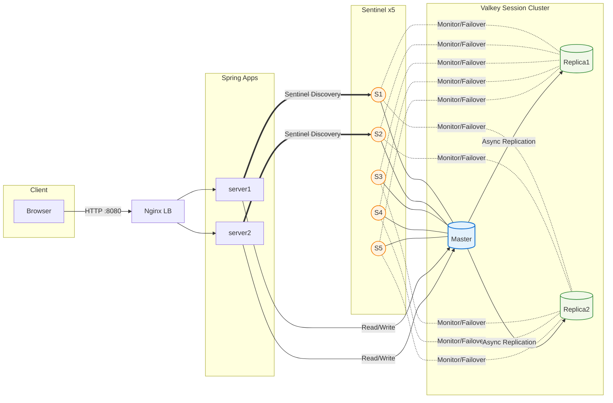

# Spring Session with Valkey (Sentinel) 연결 구성 및 검증

## 개요
- 목적: Spring 애플리케이션이 Valkey(=Redis 호환)를 Sentinel 경유로 접속하여 세션을 저장/공유하도록 구성
- 구성: Valkey 3노드(Primary 1, Replica 2) + Sentinel 5노드
- 네트워크: `incident-net` (docker compose 공유 네트워크)

## 적용 내용

### 1) Gradle 의존성
```groovy
// application/build.gradle
dependencies {
    implementation 'org.springframework.boot:spring-boot-starter-data-redis'
    implementation 'org.springframework.session:spring-session-data-redis'
}
```

### 2) Spring 설정(application.properties)
```properties
# 애플리케이션 공통
spring.application.name=incident_response
server.port=${SERVER_PORT:8080}

# Sentinel 경유 Redis 연결
spring.data.redis.sentinel.master=valkey-session-master
spring.data.redis.sentinel.nodes=valkey-sentinel1:26379,valkey-sentinel2:26379,valkey-sentinel3:26379,valkey-sentinel4:26379,valkey-sentinel5:26379
spring.data.redis.sentinel.password=valkey_sentinel_password
spring.data.redis.password=valkey_session_password
spring.data.redis.timeout=5000

# Spring Session 저장소를 Redis로
spring.session.store-type=redis
spring.session.redis.flush-mode=on-save
spring.session.redis.namespace=spring:session
```

참고: spring-boot 3.5.x에서 `spring.session.store-type=redis` 경고가 보일 수 있으나 동작에는 영향 없음.

### 3) 세션 확인 엔드포인트
```java
// application/src/main/java/dev/incident_response/web/HomeController.java
@GetMapping("/session")
@ResponseBody
public String sessionInfo(HttpSession session) {
    Object val = session.getAttribute("demo");
    return "sessionId=" + session.getId() + ", demo=" + (val == null ? "null" : val.toString());
}

@PostMapping("/session")
@ResponseBody
public String setSession(HttpSession session) {
    session.setAttribute("demo", "hello");
    return "OK:" + session.getId();
}
```

## 배포 및 실행
```powershell
# 애플리케이션 빌드
cd application
./gradlew.bat clean bootJar

# 컨테이너 재빌드/재기동
docker compose up -d --build
```

## 동작 검증
- Sentinel 상태: master=172.18.0.5:6379, replicas=2, quorum=3 (정상)
- 세션 스모크 테스트 (동일 쿠키 유지):
```powershell
$ws = New-Object Microsoft.PowerShell.Commands.WebRequestSession
(Invoke-WebRequest -UseBasicParsing -WebSession $ws -Method POST http://localhost:8080/session).Content
(Invoke-WebRequest -UseBasicParsing -WebSession $ws http://localhost:8080/session).Content
```
예상 결과:
```
OK:<same-session-id>
sessionId=<same-session-id>, demo=hello
```

## 동작 방식 시각화


### 1) 아키텍처 개요 다이어그램


### 3) 페일오버 시나리오 개요
- Sentinel 과반(3 이상)이 Master 이상 감지 → 선출 알고리즘으로 새 Master 지정(보통 기존 Replica)
- 애플리케이션은 Sentinel로부터 새 Master 주소를 재발견 → 추가 재배포 없이 자동 복구
- 기존 Master는 자동으로 Replica로 강등되어 동기화

## 트러블슈팅 요약
- 이슈: Sentinel `s_down` (잘못된 master IP 172.20.0.6 감시)
- 원인: sentinel1~5.conf의 monitor 대상 IP 오기
- 조치: monitor 대상을 호스트명 `valkey-session-primary`로 변경하고 `sentinel resolve-hostnames yes` 추가
- 결과: Sentinel이 올바른 master(172.18.0.5) 추적, 세션 저장/조회 정상화

## 참고
- 네트워크: `incident-net` (docker)
- 보안: Sentinel 비밀번호 `valkey_sentinel_password`, Valkey 비밀번호 `valkey_session_password`
- Health: Valkey/Sentinel 모든 컨테이너 healthy
